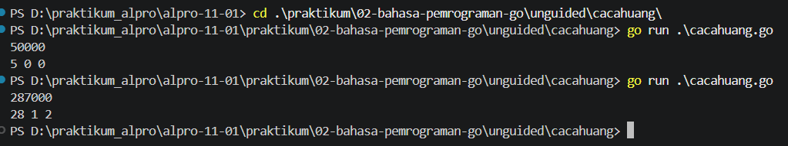
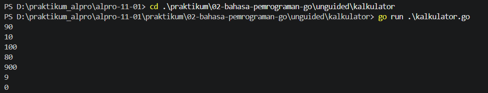

# <h1 align="center">Laporan Praktikum Modul 00 - Bahasa Pemrograman Go</h1>
<p align="center">Rafiq Khairan Putra Permana - 109092600008</p>

## Dasar Teori

### A. Bahasa Pemrograman Go
Bahasa pemrograman Go atau yang sering disebut Golang merupakan bahasa pemrograman yang dikembangkan oleh Google pada tahun 2009 dan mulai dipublikasikan secara resmi pada tahun 2012. Go dirancang khusus untuk kebutuhan pengembangan perangkat lunak yang cepat, efisien, dan mudah dikelola, terutama pada aplikasi berskala besar. Bahasa ini menggabungkan sintaks yang sederhana seperti C, tetapi dilengkapi fitur modern seperti garbage collection, concurrency, dan pengelolaan program yang terstruktur.

Go banyak digunakan dalam pengembangan aplikasi backend, layanan web, serta sistem yang membutuhkan performa tinggi. Salah satu keunggulan utama Go adalah kemampuan menangani banyak proses secara bersamaan melalui goroutine dan channel. Selain itu, Go juga memiliki ekosistem yang kuat, tooling yang lengkap, serta struktur kode yang mudah dibaca dan dipelihara. Oleh karena itu, bahasa ini sangat cocok untuk dipelajari oleh pemula maupun pengembang profesional.

### B. Package dan Struktur Program di Go

#### 1. Pengertian package main dan func main()
Pada bahasa Go, setiap file program dimulai dengan deklarasi package. Package main adalah package utama yang biasanya digunakan dalam program aplikasi. Di dalam package main, terdapat fungsi utama yang disebut `main()`. Fungsi ini merupakan titik awal eksekusi program, sehingga setiap instruksi yang berada di dalamnya akan dieksekusi saat program berjalan.

Contoh:
```go
package main

import "fmt"

func main() {
    fmt.Println("Hello World!")
}
```

Pada contoh di atas, `package main` menunjukkan bahwa file tersebut adalah program utama, `import "fmt"` digunakan untuk mengambil package `fmt`, dan `func main()` adalah fungsi yang akan dijalankan pertama kali saat program dimulai.

#### 2. Tipe Data dan Deklarasi Variabel di Go
Go memiliki beberapa tipe data dasar, seperti `string`, `int`, `float64`, `bool`, dan `byte`. Variabel di Go dapat dideklarasikan dengan beberapa cara, misalnya:
- `var nama string`
- `var umur int = 20`
- `nama := "Rafiq"` (short declaration)

Penggunaan `:=` hanya dapat digunakan saat mendeklarasikan variabel baru di dalam fungsi. Go termasuk bahasa yang bersifat strongly typed, artinya tipe data variabel harus sesuai dengan nilai yang diberikan. Sifat ini membuat program lebih aman, jelas, dan mudah diprediksi saat dikembangkan dalam skala yang lebih besar.

## Guided

### 1. hello.go

```go
package main

import "fmt"

func main() {
    fmt.Println("Hello World!")
}
```

#### Deskripsi
Pada sesi guided, saya membuat program sederhana untuk memahami struktur dasar bahasa Go. Program ini dimulai dengan deklarasi `package main`, lalu mengimpor package `fmt` untuk digunakan dalam fungsi `Println()`. Ketika program dijalankan, output yang muncul adalah "Hello World!". Praktikum ini membantu saya memahami cara kerja program Go dan peran fungsi `main()` sebagai titik awal eksekusi.

### 2. main.go

```go
package main

import "fmt"

func main() {
    var nama string = "Rafiq Khairan Putra Permana"
    var umur int = 20

    fmt.Println("Nama:", nama)
    fmt.Println("Umur:", umur)
}
```

#### Deskripsi
Pada file `main.go`, saya membuat program yang menampilkan data diri menggunakan variabel `nama` bertipe `string` dan `umur` bertipe `int`. Hasil dari program kemudian ditampilkan melalui `fmt.Println()`. Dengan kegiatan ini, saya dapat memahami cara mendeklarasikan variabel dan menampilkan datanya ke console.

## Unguided

### 1. cacahuang

```go
package main

import "fmt"

func main() {
    var harga int = 25000
    var jumlah int = 3
    total := harga * jumlah

    fmt.Println("Harga per item:", harga)
    fmt.Println("Jumlah item:", jumlah)
    fmt.Println("Total pembayaran:", total)
}
```

##### Output
##### Output

#### Deskripsi
Pada soal unguided pertama, saya membuat program untuk menghitung total pembayaran berdasarkan harga per item dan jumlah barang. Program ini menggunakan variabel dan operator perkalian untuk menghasilkan nilai total. Setelah dieksekusi, hasilnya ditampilkan di console. Kegiatan ini melatih saya dalam memahami penggunaan variabel, operasi aritmatika, dan fungsi output di Go.

### 2. kalkulator

```go
package main

import "fmt"

func main() {
    var a int = 10
    var b int = 5

    fmt.Println("Penjumlahan:", a+b)
    fmt.Println("Pengurangan:", a-b)
    fmt.Println("Perkalian:", a*b)
    fmt.Println("Pembagian:", a/b)
}
```

##### Output
##### Output


#### Deskripsi
Pada soal unguided kedua, saya membuat program kalkulator sederhana yang melakukan operasi dasar aritmatika, yaitu penjumlahan, pengurangan, perkalian, dan pembagian. Program ini menunjukkan bahwa Go dapat digunakan untuk melakukan perhitungan matematis dengan sintaks yang sederhana. Dengan demikian, saya semakin memahami cara menggabungkan variabel dan operator aritmatika dalam satu program.

## Kesimpulan
Berdasarkan praktikum yang telah dilakukan, dapat disimpulkan bahwa bahasa pemrograman Go memiliki struktur program yang sederhana namun sangat penting untuk dipahami. Pemahaman mengenai `package main`, fungsi `main()`, variabel, tipe data, serta cara menampilkan output merupakan dasar yang sangat diperlukan dalam belajar Go. Praktikum guided dan unguided membantu saya memahami konsep dasar pemrograman dan menerapkannya dalam program sederhana. Dengan demikian, tujuan praktikum ini tercapai, yaitu mengenalkan dasar-dasar bahasa pemrograman Go dan melatih kemampuan berpikir logis dalam menyusun program.

## Referensi
1. The Go Team. (n.d.). *Go Documentation*. Diakses pada 27 September 2026 melalui https://go.dev/doc/
2. The Go Team. (n.d.). *A Tour of Go*. Diakses pada 27 September 2026 melalui https://go.dev/tour