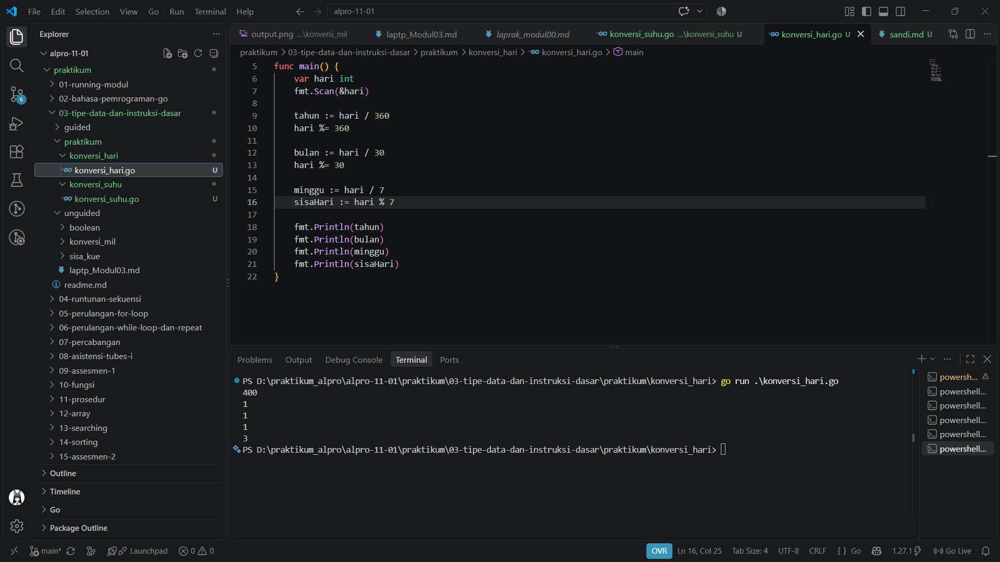
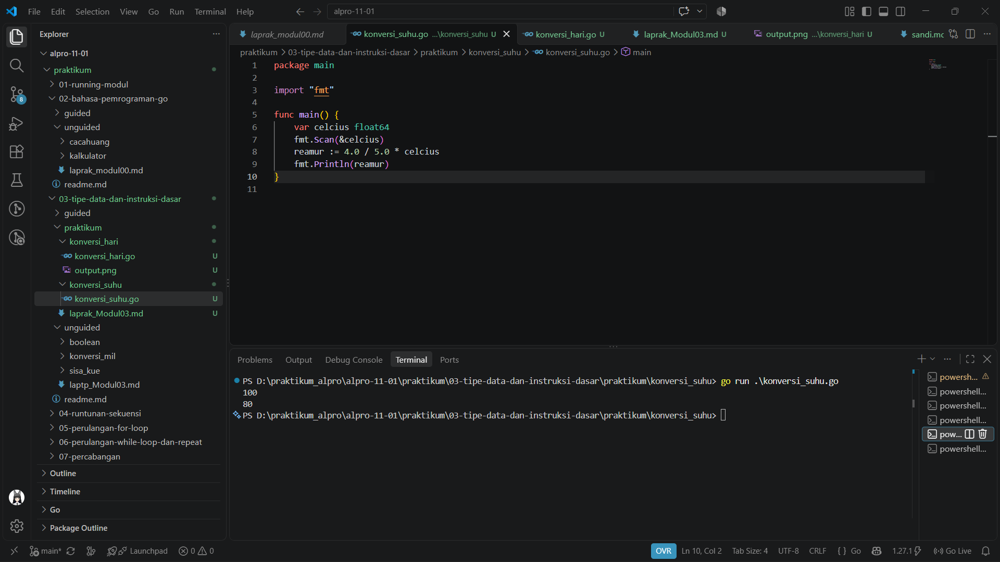

# <h1 align="center">Laporan Praktikum Modul 03 - Tipe Data dan Instruksi Dasar</h1>
<p align="center">Rafiq Khairan Putra Permana - 109092600008</p>

## Dasar Teori

### A. Variabel dan Tipe Data
Variabel adalah tempat untuk menyimpan nilai yang digunakan selama program berjalan. Di Go, variabel dapat dideklarasikan menggunakan kata kunci `var` dengan mencantumkan nama dan tipe datanya, atau menggunakan deklarasi singkat `:=` di dalam fungsi. Setiap variabel memiliki tipe tertentu, sehingga nilai yang disimpan harus sesuai dengan tipe tersebut.

Tipe data yang digunakan pada latihan praktikum ini adalah `int` untuk bilangan bulat, seperti jumlah hari, dan `float64` untuk bilangan pecahan, seperti suhu. Pemilihan tipe data yang tepat membantu program mengolah nilai dengan benar. Operasi pembagian pada `int` menghasilkan bilangan bulat, sedangkan `float64` dapat menyimpan bagian pecahan.

### B. Input dan Output
Package `fmt` menyediakan fungsi untuk membaca masukan dan menampilkan hasil. `fmt.Scan` membaca nilai dari masukan standar ke variabel yang alamatnya diberikan, misalnya `fmt.Scan(&nilai)`. `fmt.Println` dapat digunakan untuk menampilkan nilai ke layar.

### C. Operator dan Instruksi Dasar
Operator yang dipakai dalam latihan ini meliputi `/` (pembagian) dan `%` (sisa pembagian). Operator penugasan seperti `=` dan `%=` digunakan untuk menyimpan atau memperbarui nilai variabel. Instruksi program dieksekusi berurutan, sehingga hasil suatu perhitungan dapat dipakai pada langkah berikutnya.

## Praktikum

### 1. Konversi Hari

```go
package main

import "fmt"

func main() {
	var hari int
	fmt.Scan(&hari)

	tahun := hari / 360
	hari %= 360

	bulan := hari / 30
	hari %= 30

	minggu := hari / 7
	sisaHari := hari % 7

	fmt.Println(tahun)
	fmt.Println(bulan)
	fmt.Println(minggu)
	fmt.Println(sisaHari)
}
```

##### Output


#### Deskripsi
Program menguraikan jumlah hari menjadi tahun, bulan, minggu, dan sisa hari dengan asumsi satu tahun terdiri dari 360 hari, satu bulan 30 hari, dan satu minggu 7 hari. Operator pembagian dan sisa pembagian digunakan bertahap untuk memperoleh setiap bagian.

### 2. Konversi Suhu Celsius ke Reamur

```go
package main

import "fmt"

func main() {
	var celcius float64
	fmt.Scan(&celcius)
	reamur := 4.0 / 5.0 * celcius
	fmt.Println(reamur)
}
```

##### Output


#### Deskripsi
Program membaca suhu Celsius sebagai `float64`, kemudian mengubahnya ke Reamur menggunakan rumus `4/5 × Celsius`. Pembilang dan penyebut ditulis sebagai bilangan pecahan agar perhitungan tidak menggunakan pembagian bilangan bulat.

## Kesimpulan
Praktikum Modul 03 memberikan pemahaman tentang penggunaan variabel dan tipe data `int` serta `float64` dalam program Go. Melalui latihan konversi hari dan suhu, saya mempraktikkan pembacaan input dengan `fmt.Scan`, penampilan hasil dengan `fmt.Println`, dan penggunaan operator pembagian serta sisa pembagian. Pemilihan tipe data dan urutan instruksi yang sesuai membantu program menghasilkan keluaran yang diharapkan.

## Referensi
1. The Go Team. (n.d.). *Go Documentation*. https://go.dev/doc/
2. The Go Team. (n.d.). *A Tour of Go*. https://go.dev/tour/
