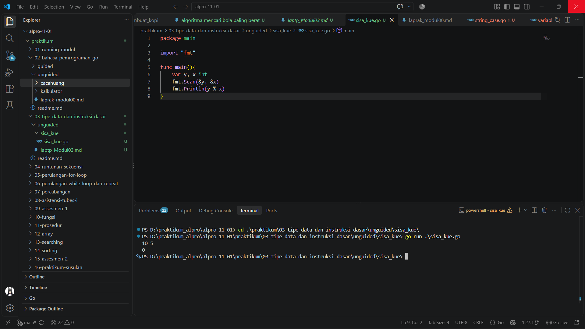
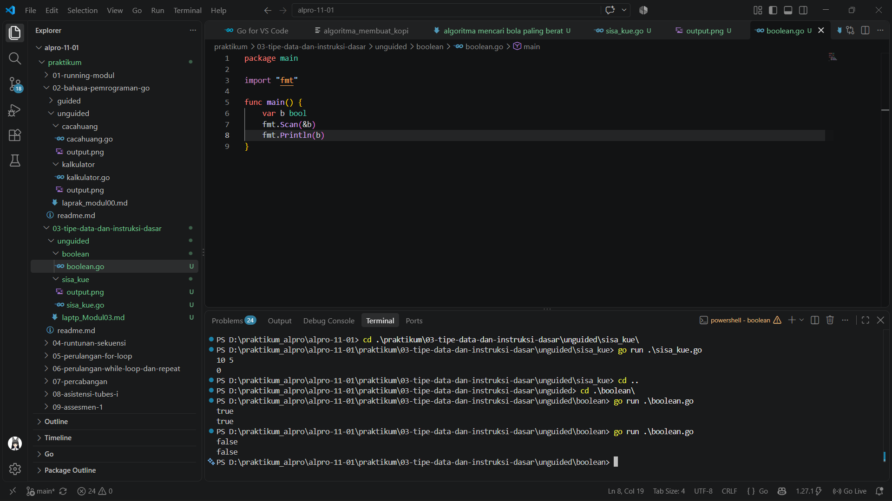
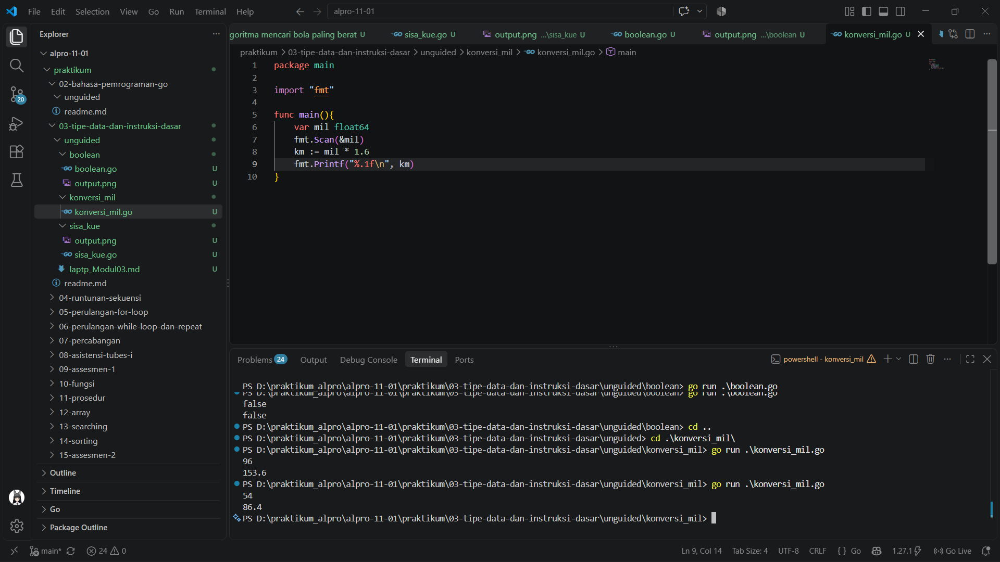

# <h1 align="center">Tugas Pendahuluan Modul 3 - VARIABEL DAN OPERATOR</h1>
<p align="center">[VARIABEL DAN OPERATOR] - [109092600008]</p>

### 1. Sisa Kue

```go
package main

import "fmt"

func main(){
	var y, x int
	fmt.Scan(&y, &x)
	fmt.Println(y % x)
}
```

##### Output
<!-- Path relatif dari readme.md ke folder unguided/[nama_soal]/output.png, contoh: -->


#### Deskripsi
Pada soal ini, program menerima dua bilangan bulat, lalu menggunakan operator `%` untuk mencari sisa pembagian bilangan pertama dengan bilangan kedua. Hasilnya langsung ditampilkan ke layar, jadi kita bisa melihat bagaimana operator aritmetika bekerja pada tipe data `int`.

### 2. boolean

```go
package main

import "fmt"

func main() {
	var b bool
	fmt.Scan(&b)
	fmt.Println(b)
}
```

##### Output
<!-- Path relatif dari readme.md ke folder unguided/[nama_soal]/output.png, contoh: -->



#### Deskripsi
Di soal ini, program membaca sebuah nilai bertipe `bool` (`true` atau `false`), kemudian menampilkan kembali nilai tersebut. Latihan ini membantu memahami penggunaan tipe data boolean serta cara menerima dan menampilkan input sederhana di Go.

### 3. konversi mil

```go
package main

import "fmt"

func main(){
	var mil float64
	fmt.Scan(&mil)
	km := mil * 1.6
	fmt.Printf("%.1f\n", km)	
}
```

##### Output
<!-- Path relatif dari readme.md ke folder unguided/[nama_soal]/output.png, contoh: -->



#### Deskripsi
Program menerima jarak dalam satuan mil, mengalikannya dengan 1,6 untuk mengubahnya ke kilometer, lalu menampilkan hasil dengan satu angka di belakang koma. Karena nilai jarak dapat berupa pecahan, program menggunakan tipe data `float64`.

## Kesimpulan
Lewat latihan ini, saya belajar menggunakan variabel dan tipe data yang sesuai, membaca input dengan `fmt.Scan`, serta mengolah dan menampilkan hasil di Go. Operator `%` digunakan untuk mencari sisa pembagian, nilai boolean dapat dibaca dan ditampilkan, dan perkalian dapat dipakai untuk mengonversi satuan. Pemilihan tipe data yang tepat membuat hasil program sesuai dengan jenis nilai yang diolah.