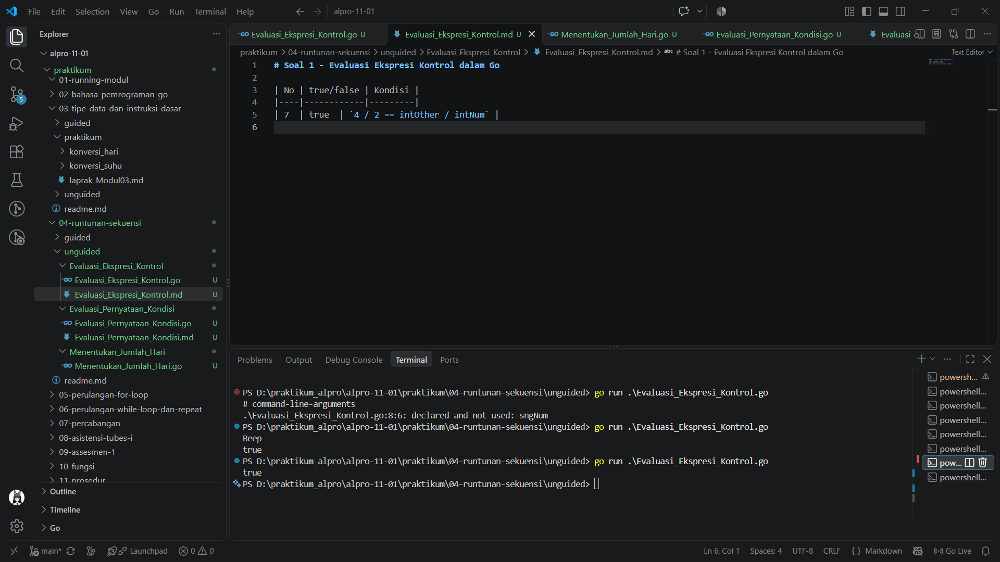
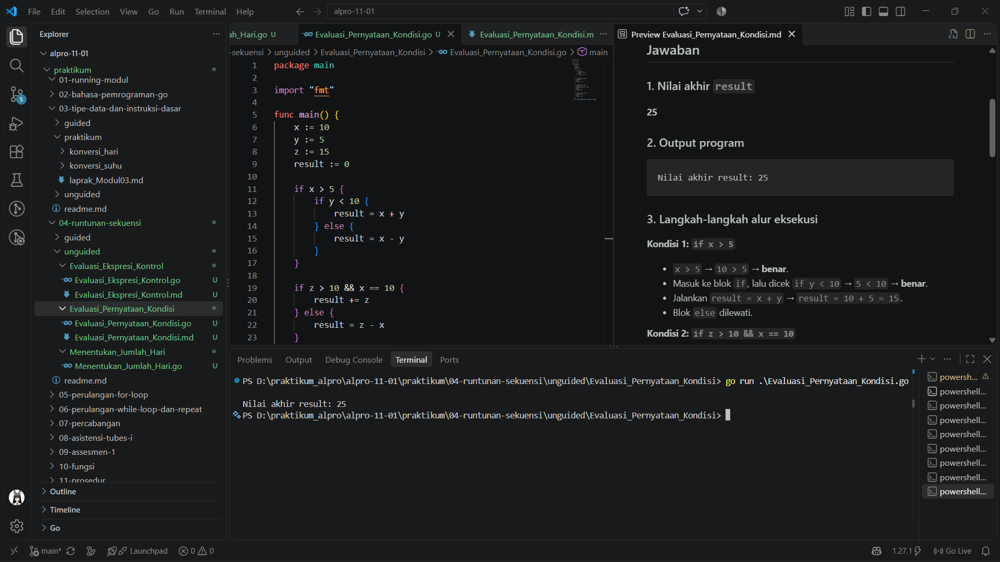
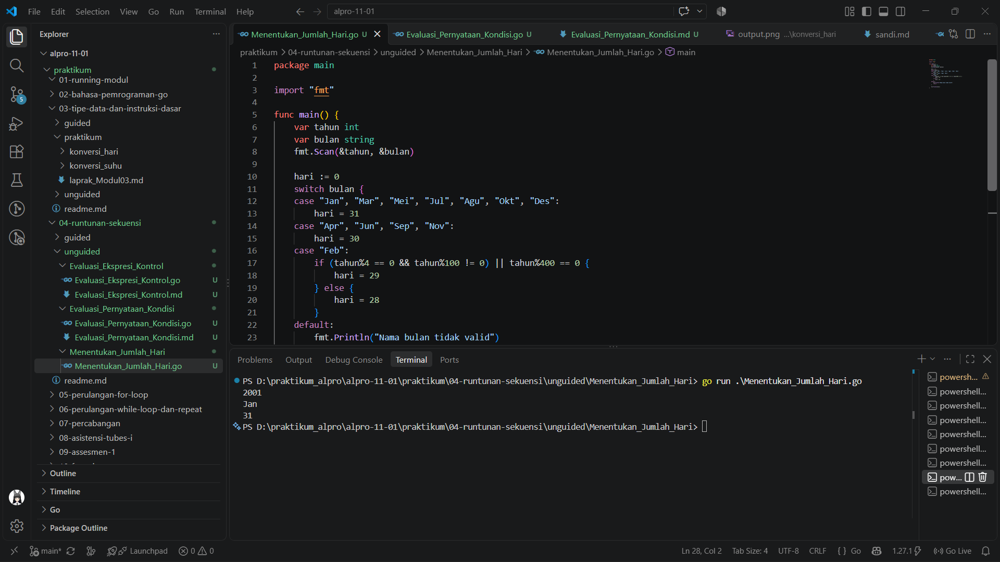

# <h1 align="center">Tugas Pendahuluan Modul 4 - RUNTUNAN/SEKUENSI</h1>
<p align="center">RUNTUNAN/SEKUENSI - 109092600008</p>

### 1. Evaluasi Ekspresi Kontrol

```go
package main

import "fmt"

func main() {
	intNum := 5
	intOther := 10
	var sngNum float64 = -3
	_ = sngNum

	fmt.Println(4/2 == intOther/intNum)
}
```

##### Output


#### Deskripsi
Program mengevaluasi ekspresi `4/2 == intOther/intNum`. Karena semua operand pembagian bertipe integer, kedua pembagian menghasilkan bilangan bulat: `4/2` bernilai `2` dan `10/5` juga bernilai `2`. Kedua nilai sama, sehingga program mencetak `true`.

### 2. Evaluasi Pernyataan Kondisi

```go
package main

import "fmt"

func main() {
	x := 10
	y := 5
	z := 15
	result := 0

	if x > 5 {
		if y < 10 {
			result = x + y
		} else {
			result = x - y
		}
	}

	if z > 10 && x == 10 {
		result += z
	} else {
		result = z - x
	}

	if x == 10 || y > 10 {
		result += 5
	} else if y == 5 && z > 10 {
		result -= 5
	} else {
		result *= 2
	}

	if !(x < 15 && y < 10) {
		result += 10
	} else {
		result -= 10
	}

	fmt.Println("Nilai akhir result:", result)
}
```

##### Output


#### Deskripsi
Latihan ini menelusuri perubahan nilai `result` melalui beberapa pernyataan `if`, termasuk kondisi bertingkat serta operator logika `&&`, `||`, dan `!`. Kondisi pertama menetapkan `result` menjadi `10 + 5 = 15`. Kondisi kedua benar, sehingga nilainya bertambah `15` menjadi `30`. Kondisi ketiga juga benar, sehingga bertambah `5` menjadi `35`. Pada kondisi terakhir, `x < 15 && y < 10` bernilai benar dan negasinya bernilai salah; blok `else` mengurangi `10`. Nilai akhir yang dicetak adalah `25`.

### 3. Switch Case Hari

```go
package main

import "fmt"

func main() {
	var hari int
	fmt.Print("Masukkan angka hari (1-7): ")
	fmt.Scan(&hari)

	switch hari {
	case 1:
		fmt.Println("Senin")
	case 2:
		fmt.Println("Selasa")
	case 3:
		fmt.Println("Rabu")
	case 4:
		fmt.Println("Kamis")
	case 5:
		fmt.Println("Jumat")
	case 6, 7:
		fmt.Println("Akhir pekan")
	default:
		fmt.Println("Angka tidak valid")
	}
}
```

##### Output


#### Deskripsi
Program menerima angka hari dari `1` sampai `7`, lalu menggunakan `switch` untuk menampilkan nama hari. Hari ke-6 dan ke-7 dikelompokkan sebagai akhir pekan. Jika angka yang dimasukkan tidak termasuk rentang tersebut, program menampilkan pesan bahwa angka tidak valid.

### 4. Menentukan Jumlah Hari

```go
package main

import "fmt"

func main() {
	var tahun int
	var bulan string
	fmt.Scan(&tahun, &bulan)

	hari := 0
	switch bulan {
	case "Jan", "Mar", "Mei", "Jul", "Agu", "Okt", "Des":
		hari = 31
	case "Apr", "Jun", "Sep", "Nov":
		hari = 30
	case "Feb":
		if (tahun%4 == 0 && tahun%100 != 0) || tahun%400 == 0 {
			hari = 29
		} else {
			hari = 28
		}
	default:
		fmt.Println("Nama bulan tidak valid")
		return
	}

	fmt.Println(hari)
}
```

##### Output


#### Deskripsi
Program membaca tahun dan singkatan nama bulan, kemudian menentukan jumlah hari menggunakan `switch`. Bulan dengan 31 hari dan 30 hari dikelompokkan pada masing-masing `case`. Untuk Februari, program memeriksa tahun kabisat: tahun harus habis dibagi 4 dan tidak habis dibagi 100, kecuali tahun yang habis dibagi 400. Jika nama bulan tidak dikenali, program menampilkan pesan kesalahan.

## Kesimpulan
Melalui latihan Modul 4, saya belajar mengevaluasi ekspresi dan menelusuri alur program berdasarkan kondisi. Pernyataan `if` dapat menangani percabangan bertingkat dan menggabungkan kondisi dengan operator logika, sedangkan `switch` memudahkan pemilihan keluaran berdasarkan nilai tertentu. Runtunan instruksi yang tepat membantu program menghasilkan keluaran sesuai input dan aturan yang diberikan.
